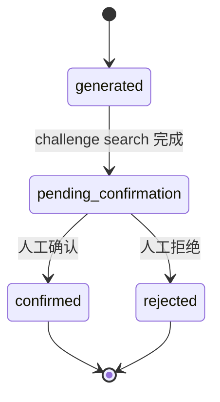

# Agent 与工作流设计

## 原则

- 一个可审计总流程；
- 节点单一职责；
- 能用确定性代码解决的步骤不交给自由 Agent；
- 关键决策有人在环；
- 状态和输出哈希持久化；
- 失败、取消、恢复均显式。

## 文献发现

`ResearchProfile → QueryFormulation → QueryExpansion → FederatedSearch → Normalize → Deduplicate → PersistSearchEvidence → Rank → HumanReview`

当前已实现：联邦搜索、规范化、去重、来源状态和搜索会话。查询扩展目前主要在 gap challenge 中；通用方向拆解与主题聚类仍需补足。

## 论文分析

`ResolvePaper → FetchMetadata → ResolveAccess → Parse → Chunk → Index → RetrieveEvidence → StructuredExtraction → CitationBoundary → PersistAnalysis`

当前分析是确定性节点；未来 LLM 节点必须是受 Schema 和 citation validator 控制的可替换节点。

## 候选空白

`confirm` 不接受 generated 状态。challenge 保存 queries、source status、counter candidates、时间和 AgentRun。

## 计划

`ConfirmedGap → PrerequisiteReading → CoreReading → Reproduction → DatasetPreparation → Baseline → MinimalExperiment → RiskCheck → Milestone → UserEditing`

计划项可设 `pending/in_progress/done/blocked`。

## 审计字段

AgentRun：run_id、user/project、workflow type/version、prompt version、model provider/name、input/output JSON、status、started/finished、error、output hash。

Job：type、payload/result、attempt、lock、started/finished/cancelled；JobEvent 保存 created/started/succeeded/retry/failed/cancelled/recovered。当前 worker 已有真实处理器：`paper_analysis` 调用证据分析服务，`recommendation_refresh` 调用透明推荐服务，`gap_challenge` 调用反证检索服务；非法输入会记录错误并按 `max_attempts` 重试。

## LangGraph 决策

当前不引入 LangGraph，原因：V2 状态门和节点数量尚可用显式 Python 状态机表达，引入图框架会增加依赖而不提高证据性。达到以下条件再评估：多分支长任务、人工中断恢复、并行工具链和可视化追踪成为稳定需求。此决策记录在 ADR。

## 2.2 证据工作流（bounded orchestration）

`evidence_workflow_v1` 不是自由 Agent 群，而是持久、可取消、可审计的有界状态机。身份解析、摘要补充、OA 发现、许可证策略、PDF 安全验证、解析、确定性分析、可选 LLM 补充和研究卡刷新分别写 `JobEvent`。任何外部失败都要产生明确 step/error/source status；可恢复失败形成 `partial`，不得无限重试或丢弃已有证据。

LLM 只处理由应用传入的受限证据，并由应用校验 JSON、citation ownership、evidence level 和字段边界。模型不能自行设置人工权利确认、专家验证或 Gap human confirmation。
