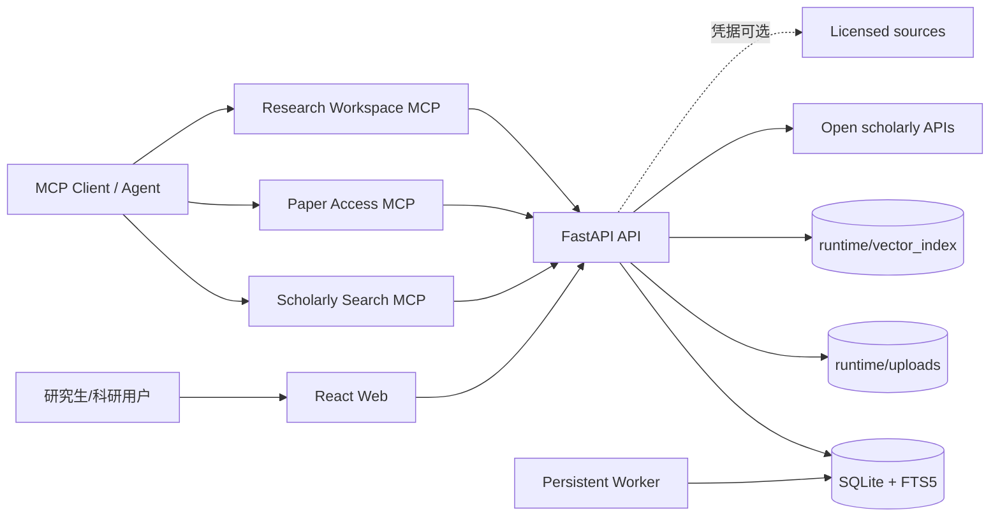
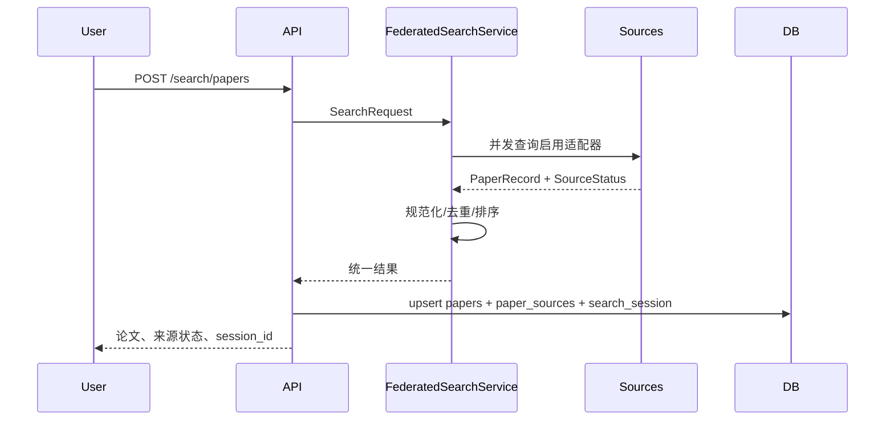
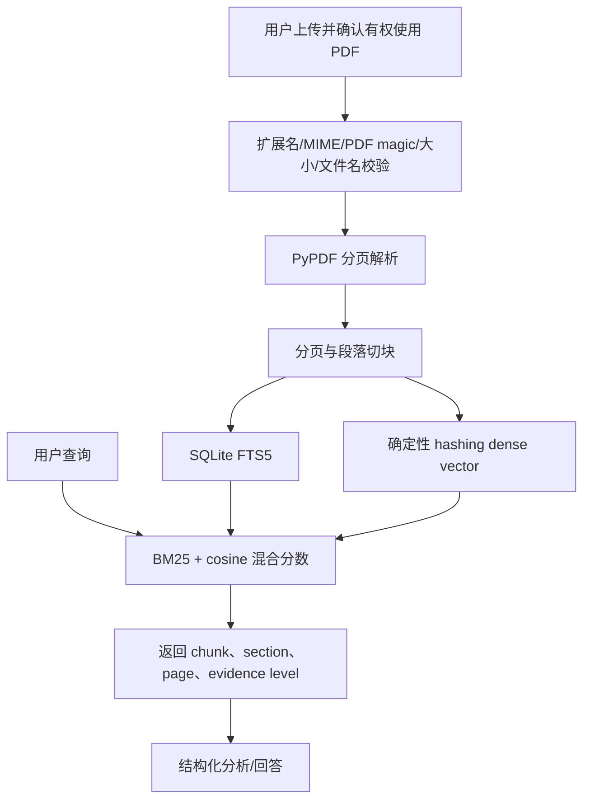
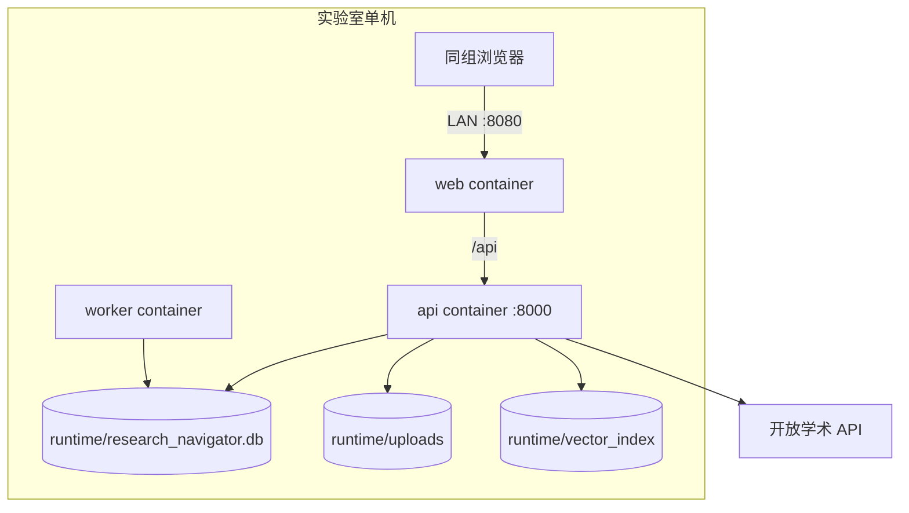

# 系统架构

## 1. 系统上下文



## 2. 容器关系

- `web`：Nginx 托管 Vite 构建产物，并代理 `/api`；
- `api`：认证、业务规则、检索适配器、文档摄取、评分和工作流；
- `worker`：轮询 SQLite jobs，恢复中断状态并执行允许的任务；
- `runtime`：宿主机绑定目录，保存数据库、上传、向量状态和备份。

不使用 Redis 是 V1 的 YAGNI 决策。SQLite 适用于单主机小组部署，不用于多主机共享写入。

## 3. 组件边界

| 组件 | 职责 | 不负责 |
|---|---|---|
| `scholarly/*` | 外部源适配、规范化、去重、provenance | 用户收藏和 gap 判断 |
| `documents/*` | PDF 安全、解析、切块、索引、召回 | 绕过付费墙、任意 URL 下载 |
| `analysis/*` | evidence-level 结构化分析与评分 | 证明论文创新、猜测作者贡献 |
| `gaps/*` | 证据矩阵、候选陈述、challenge queries | 绝对新颖性证明 |
| `plans/*` | 从确认问题生成可编辑计划 | 自动执行科研实验 |
| `routes/*` | HTTP 合同、认证和所有权检查 | 域逻辑堆叠 |
| `mcp_servers/*` | 标准化工具入口 | 替代 API 的权限和证据控制 |
| `services/worker` | 持久任务执行 | 自由 Agent 群 |

## 4. 论文搜索数据流



## 5. PDF/RAG 数据流



当前稠密表示是离线可复现的 hashing vector，不应表述为语义基础模型 embedding。未来替换向量实现时必须保持 chunk、引用和检索评测不变。

## 6. Gap 工作流

`generated → pending_confirmation → confirmed|rejected`。只有 challenge search 设置 `challenge_completed_at` 后，确认接口才允许状态转换。任何绕过该状态门的调用返回 409。

## 7. 故障与降级

- 单一论文源失败不取消其他源；
- LLM 未配置时确定性分析继续；
- 没有全文时降级到摘要或元数据；
- MCP SDK 未安装时不启动 stdio，并明确报错；
- worker 重启把 running 任务恢复为 pending 并记录事件；
- Docker 不可用不影响原生开发，但不能宣称容器验收通过。

## 8. 部署图



## 9. 2.2 证据平台扩展

### 9.1 版本化证据工作流

完整证据升级不复用单个长连接请求，而是通过持久 `Job(job_type=evidence_workflow_v1)` 和有序 `JobEvent` 执行：

```text
created
→ identity_resolution
→ abstract_acquisition
→ oa_location_discovery
→ license_policy
→ remote_pdf_fetch
→ pdf_security_validation
→ pdf_parse_and_index
→ deterministic_analysis
→ optional_llm_enrichment
→ author_card_refresh
→ dataset_card_refresh
→ direction_cluster_refresh
→ succeeded | partial | failed | cancelled
```

外部来源或 OA 下载失败可以形成 `partial`，但必须保留已经取得的最高证据等级、失败码和来源状态。旧的 `/papers/{id}/acquire-evidence` 仍保留摘要级兼容语义。

### 9.2 OA 与 PDF 安全边界

`open_access/*` 负责候选入口、许可证/访问决策和安全下载；`documents/*` 继续负责统一解析、切块、FTS5 与本地向量索引。未知许可证不得自动下载。`SafePdfFetcher` 对每次重定向重新做 DNS/IP 校验，拒绝私网、回环、链路本地、保留地址、登录页和 HTML 伪 PDF，并实施大小、MIME、`%PDF-` magic 与 SHA256 检查。

### 9.3 确定性分析与可选 LLM

确定性分析始终先执行并定义 evidence level。OpenAI-compatible/Ollama Provider 只能补充仍为 unknown 且有本地 citation 的字段。无效 JSON、坏引用、跨论文引用、证据越界或 Provider 错误都会写入 fallback reason，并返回确定性结果。Provider、model、prompt、输入证据哈希、输出哈希、延迟、尝试次数和 token usage 写入审计；密钥和 Authorization 不落盘。

### 9.4 研究地图与评测

- `authors/*`：只按 ORCID/OpenAlex/Semantic Scholar 等稳定 ID 合并；同名无 ID 保持 unresolved；
- `datasets/*`：按分析证据创建 mention/card，不从名称补造切分、许可证或样本量；
- `clustering/*`：`direction-cluster-v1` 使用确定性 hashing vector、余弦图和连通分量；聚类只是文献组织结果；
- `evaluations/*`：冻结研究、盲化 assignment、真实/模拟评分分离。模拟评分永远不能把专家验证状态升级为真实有效。
