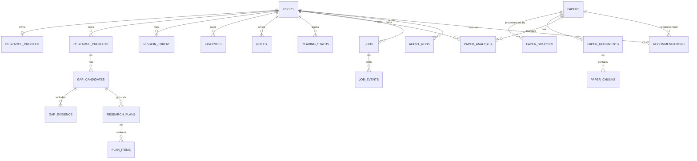

# 数据库设计

## 1. 选择与运行约束

- SQLite、WAL、`foreign_keys=ON`、`busy_timeout=5000`；
- 单主机部署；不得把数据库放在不支持 SQLite 锁语义的共享网络盘；
- 全部业务时间戳使用 UTC；
- 论文元数据全局复用，用户收藏、笔记、档案、gap、计划和任务按 `user_id` 隔离。

## 2. 核心 ER 图

## 3. 主要表

| 表 | 关键字段 | 约束/索引 |
|---|---|---|
| users | email, password_hash, is_admin | email 唯一 |
| session_tokens | token_hash, expires_at, revoked_at | 只存 token hash |
| research_profiles | stage, direction, keywords, constraints | user_id 唯一 |
| research_projects | name, broad_direction, status | `(user_id,name)` 唯一 |
| papers | title, normalized_title, DOI, arXiv, abstract | DOI/arXiv 唯一；标题+年索引 |
| paper_sources | source, source_id, raw_hash, is_fixture | 来源身份唯一 |
| search_sessions | query, filters, source_status, result_ids | user/project 索引 |
| paper_documents | source_type, evidence_level, SHA256, path | user+paper+hash 唯一 |
| paper_chunks | page, section, text_hash, vector | document+index 唯一 |
| paper_analyses | analysis/direction/reproduction JSON | user+paper+时间索引 |
| gap_candidates | claim, matrix, counter evidence, status | user+project 索引 |
| gap_evidence | role, paper_id, rationale, query | gap 索引 |
| research_plans | objective, status, gap_id | user+project 索引 |
| plan_items | category, sequence, status, notes | plan+sequence 索引 |
| jobs/job_events | state, payload/result, event | status+created 索引 |
| agent_runs | workflow/prompt/model/version/hash | run_id 唯一 |
| recommendations | category, score, reason, evidence/version | user+project+paper+category 唯一 |

JSON 字段用于边界清晰且变化快的解释性结构；核心外键、状态和查询字段保持关系化。未来规模化前需评估 JSON 查询和迁移成本。

## 4. FTS5

虚拟表 `paper_chunks_fts` 保存 `chunk_id/document_id/paper_id/user_id/section/text`。`user_id` 作为过滤元数据，查询时必须同时检查用户可访问文档，不能只依赖全文索引结果。

## 5. 迁移

- `alembic.ini`；
- `apps/api/alembic/env.py`；
- `0001_initial_schema.py` 为初始 bootstrap。

当前 initial migration 使用 metadata 创建完整首版模式；进入长期维护前，Codex 应生成显式操作并验证 downgrade，避免未来 metadata 漂移影响历史迁移。

## 6. 删除与隔离

- 用户删除：用户私有记录级联；
- 全局 paper 不随单一用户收藏删除；
- 用户上传文档随用户删除；
- gap 删除时 evidence 级联，计划的 gap_id 可设空；
- 所有读取用户私有数据的路由必须带 `user_id` 条件。

## 7. 备份与恢复

`scripts/backup.py` 使用 SQLite online backup API 生成一致快照，并把 uploads/vector 状态打入 ZIP。恢复前停止 API 和 worker；`restore.py` 检查 ZIP 路径穿越并要求显式 `--force` 覆盖。

## 8. 2.2 新增持久对象（Alembic 0005）

| 表/扩展 | 目的 | 关键边界 |
|---|---|---|
| `source_runtime_states` | 来源 cooldown、429 header、连续失败和恢复时间 | fallback 成功不覆盖单源状态 |
| `paper_documents` 新列 | OA URL、source ID、rights basis、license、response hash、run ID、parse status | 只有合法摄取成功才提升全文证据等级 |
| `paper_analyses` 新列 | run/mode/provider/model/prompt/input/output hash/fallback | 旧分析不可变；新运行创建新版本 |
| `tool_calls` 新列 | latency、attempt、token usage、response status、validated hash | 不保存 API key/Authorization |
| `authors`, `paper_authors`, `author_source_records` | 稳定作者身份、论文顺序和来源记录 | 禁止姓名唯一合并 |
| `dataset_cards`, `paper_dataset_mentions` | 数据集身份、原始 mention、字段 citation 与证据等级 | 缺失属性不补造 |
| `direction_cluster_runs`, `direction_clusters`, `direction_cluster_members` | 版本化确定性聚类 | 保存算法、参数和输入哈希 |
| `evaluation_studies/tasks/assignments/ratings/results` | 冻结盲评与聚合 | simulated 与 real expert 分离 |

`jobs/job_events` 复用于证据工作流和历史摘要回填，避免另建不一致的任务状态机。用户拥有的分析、mention、cluster run、evaluation 和 job 必须带 `user_id` 约束；全局作者/数据集元数据只能通过用户拥有的论文或分析关系暴露。

## 9. 迁移兼容性

0005 只增加表和列，不删除 2.1.1 列，也不把历史 `Paper.abstract` 自动标记为可信。升级后历史 `paper_sources.provides_abstract` 保持原值；可信提升只能通过新的回填/证据工作流完成。迁移测试覆盖空库升级、历史库 0004→0005、降级/重升级和 FTS5 保留。
